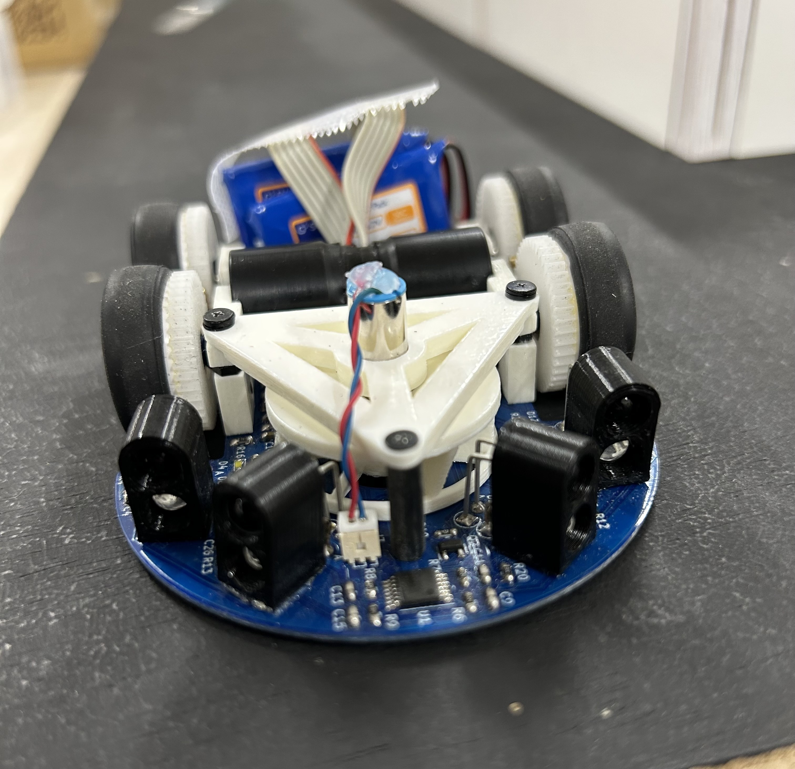

# Mercury-Firmware

### クラシックマウス1号機 Mercury v1 (2021/4~)
- [Teruru Laboratory](https://teruru-52.github.io/tags/%E3%83%9E%E3%82%A4%E3%82%AF%E3%83%AD%E3%83%9E%E3%82%A6%E3%82%B9/)
<div style="text-align: center;">
    
</div>

## 1. Development Environment
- Ubuntu 20.04
- gcc 9.4.0
- GNU Make 4.2.1
- doxygen 1.8.17

## 2. Submodules (Fork)
- [MazeSolver2015](MazeSolver2015)：マイクロマウスの迷路探索&走行経路ライブラリ
- [micromouse-control-module](https://github.com/kerikun11/micromouse-control-module)：マイクロマウス車体制御モジュール

## 3. Doxygen
```
doxygen
```
`docs/html/index.html`にリファレンスが生成される． 
